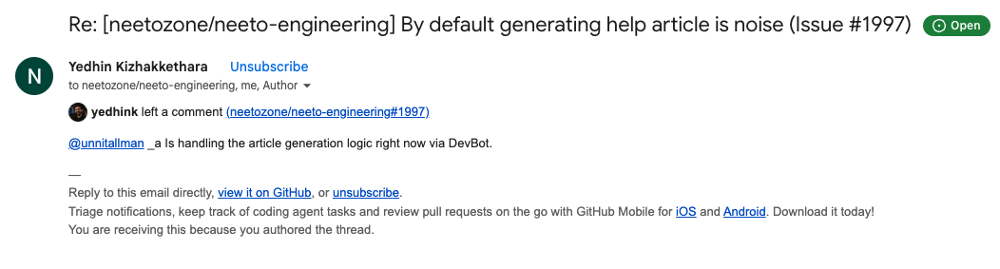
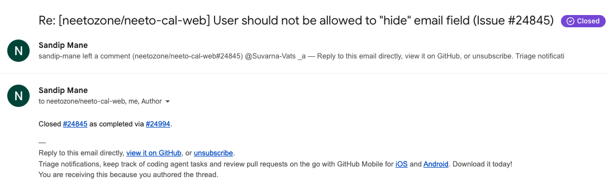

# GitHub PR status in Gmail

A tiny Chrome extension (Manifest V3) that shows the live status of the GitHub issue
or pull request referenced in a Gmail notification email — as a pill next to the
subject line, using GitHub's own State-label icons and colors.

No more opening the PR just to find out it was merged three weeks ago.

**Open:**

**Closed:**

## Features

- GitHub-identical **State pills**: Open, Merged, Closed, Draft — right colors, right Octicons.
- Handles issues **and** PRs, and correctly distinguishes merged vs. closed vs. draft.
- Click the pill to jump straight to the issue/PR on GitHub.
- Works with private repos via a GitHub token stored locally in your browser.
- No placeholder or flicker — the pill appears only once the status resolves.
- Results cached for 5 minutes to stay well under API rate limits.

## Status → color

| State | Color | Octicon |
|-------|-------|---------|
| Open issue / PR | 🟢 green `#1f883d` | issue-opened / git-pull-request |
| Merged PR | 🟣 purple `#8250df` | git-merge |
| Closed issue (completed) | 🟣 purple `#8250df` | issue-closed |
| Closed issue (not planned) | ⚪ gray `#59636e` | skip |
| Closed PR (not merged) | 🔴 red `#cf222e` | git-pull-request-closed |
| Draft PR | ⚪ gray `#59636e` | git-pull-request |

## How it works

1. When you open an email, the content script finds the
   `github.com/OWNER/REPO/(issues|pull)/N` link that every GitHub notification email
   contains (the "view it on GitHub" link).
2. It asks the background service worker for that issue/PR's status.
3. The worker calls the GitHub REST API (`/repos/.../issues/N`, plus `/pulls/N` when it's
   a PR) using your token and returns the resolved state.
4. A pill is injected next to the subject line.

The token lives only in `chrome.storage.local` (this browser) and is sent only to
`api.github.com`.

## Install (unpacked)

1. Open `chrome://extensions`.
2. Toggle **Developer mode** (top-right).
3. Click **Load unpacked** and select this folder.
4. Open the extension's options (click its toolbar icon, or **Details → Extension
   options**), paste a GitHub token, click **Save**, then **Test**.

## GitHub token

Private repos require a token. Create a **classic token** at
<https://github.com/settings/tokens/new> — the simplest option, and it works across every
org you belong to:

- **Note**: `GitHub PR status in Gmail`
- **Expiration**: `90 days`
- **Select scopes**: check `repo`
- **Generate token**, copy it, and paste it into the extension's settings.

If your org enforces SAML SSO, also click **Configure SSO** next to the token and authorize
it for the org.

🔒 The token is stored only in your browser (`chrome.storage.local`) and is sent only to
`api.github.com`.

## Troubleshooting

| Pill says | Meaning |
|-----------|---------|
| **Set GitHub token →** | No token saved. Click it to open options. |
| **No repo access →** | Token can't read that repo — make sure the `repo` scope is checked, and authorize SSO if your org requires it. |
| **Not found** | The repo is readable but that issue/PR number doesn't exist. |
| **Rate limited** | GitHub API rate limit hit; try again shortly. |

## Notes / limits

- Subject placement targets Gmail's `h2.hP` element; if Gmail changes it, the pill falls
  back to a fixed badge in the top-right of the window.
- No custom extension icon ships (Chrome shows the default puzzle piece); add an `icons/`
  folder and a manifest `icons` block if you want one.

## License

MIT © Neeraj Singh
